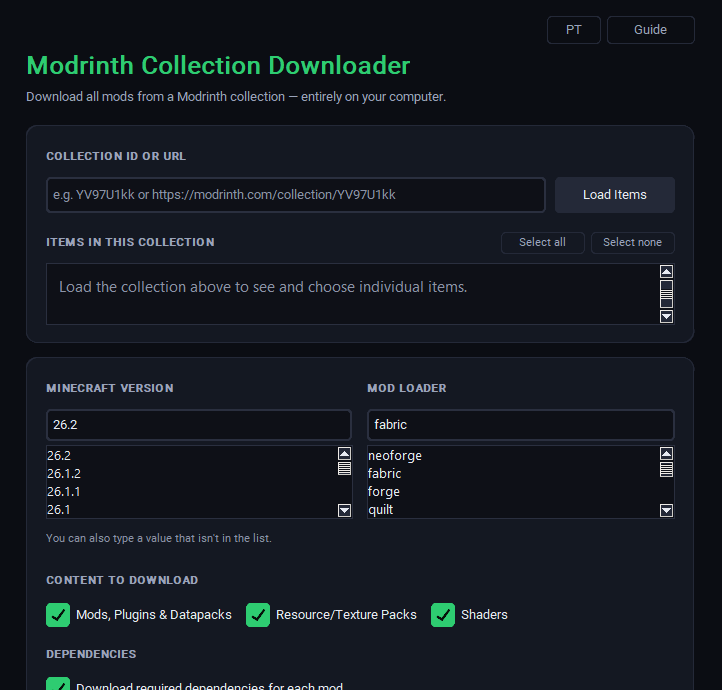

# Modrinth Collection Downloader

Download every mod, resource/texture pack, shader, plugin and datapack from a
public [Modrinth](https://modrinth.com) collection in one go, sorted
automatically into the right subfolders, or packed into a single `.zip`
named after the collection itself.

The repository includes three editions, all built on the same download
logic: a desktop GUI application, a single-file dependency-free Python CLI
(`modrinth_cli.py`), and native scripts for Windows, Linux and macOS that
do not require Python at all. See [Usage](#usage) for the GUI,
[Command-line (CLI) edition](#command-line-cli-edition) for the Python
terminal version, and [Native OS scripts](#native-os-scripts-no-python-required)
for the Python-free versions.

Made by [BryanKouki](https://github.com/BryanKouki) - v1.0.0

> This app only talks to `api.modrinth.com` (public read-only queries) and
> downloads files from `cdn.modrinth.com` (Modrinth's own CDN, hosting the
> official files). There is no telemetry, no data collection, and no
> execution of third-party code. It just downloads files, and the full
> source is right here in this repository.

<p align="center">
  
</p>

---

## Table of contents

- [Overview](#overview)
- [Features](#features)
- [Usage](#usage)
- [Command-line (CLI) edition](#command-line-cli-edition)
- [Native OS scripts (no Python required)](#native-os-scripts-no-python-required)
- [How folders are organized](#how-folders-are-organized)
- [Requirements](#requirements)
- [Running in development mode](#running-in-development-mode)
- [Building the Windows executable (.exe)](#building-the-windows-executable-exe)
- [Manual PyInstaller build](#manual-pyinstaller-build)
- [Build troubleshooting](#build-troubleshooting)
- [Project structure](#project-structure)
- [Frequently asked questions](#frequently-asked-questions)
- [Security and privacy](#security-and-privacy)
- [Contributing](#contributing)
- [Credits](#credits)
- [License](#license)

---

## Overview

Paste a collection's ID or URL, optionally review and deselect individual
items, pick a Minecraft version and a mod loader, choose what to include,
and the app will:

1. Query the official public Modrinth API for the collection's contents.
2. For every included project, resolve the right version for the chosen
   Minecraft version and loader, optionally always preferring a stable
   release over alpha/beta builds.
3. Optionally follow and download each mod's required dependencies.
4. Automatically sort every downloaded file into `mods/`, `resourcepacks/`,
   `shaderpacks/`, `plugins/` or `datapacks/`.
5. Save the result either as a plain organized folder or as a single
   `.zip` file, named after the collection, without ever overwriting
   something that already exists at the destination.
6. Report, at the end, exactly which items succeeded, which failed or were
   incompatible (and why), and which were skipped.

The interface is fully bilingual (English and Portuguese, toggled instantly
from the top bar) and defaults to English. It is a desktop GUI application:
no command-line arguments and no configuration files to edit by hand.

---

## Features

- Compact, form-first layout: the download settings are front and center,
  and the activity log stays tucked away, collapsed, until you actually
  want to read it.
- Bilingual interface (English / Portuguese) with an instant top-bar
  toggle, defaulting to English.
- Built-in guide window explaining every field and every result category
  without leaving the app.
- Collection input accepts both a bare ID (`N6yU1DBr`) and a full URL
  (`https://modrinth.com/collection/N6yU1DBr`).
- Optional per-item checklist: load the collection's contents and every
  mod, resource pack and shader shows up individually, grouped by
  category, checked by default. Uncheck anything you do not want before
  downloading. "Select all" and "Select none" shortcuts are available, and
  toggling a category filter (Mods, Resource Packs, Shaders) checks or
  unchecks every item of that category in one click. This step is entirely
  optional: skip it and the download still works using just the category
  filters described below.
- Minecraft version and mod loader pickers are a search box on top of a
  real scrollable list rather than a dropdown you have to keep clicking.
  Scroll or click through the options, or just type a value that is not in
  the list yet, which is handy right after a new Minecraft version drops.
- Mod loaders are listed in real-world popularity order: NeoForge, Fabric,
  Forge, Quilt, then the server plugin loaders (Paper, Spigot, Purpur,
  Bukkit, Folia, Sponge, Velocity, Waterfall, BungeeCord), then Datapack.
- Independent category checkboxes for what to include: Mods, Plugins and
  Datapacks; Resource and Texture Packs; Shaders.
- Optional recursive download of each mod's required dependencies.
- Optional preference for the latest stable release over newer alpha or
  beta builds.
- Automatic sorting into category subfolders, described in detail below.
- Save as an organized folder or as a single `.zip`, always named after
  the real collection name, and never overwriting an existing folder or
  zip file: it appends " (2)", " (3)", and so on instead.
- Collapsible, color-coded activity log: green for success, red for
  failures, orange for incompatible items, gray for skipped ones, hidden
  by default to keep the window compact and one click away when needed.
- Summary panel with running counts of items that succeeded, failed, were
  incompatible, or were skipped, plus a compact details list that
  automatically shows which items failed or were incompatible, and why,
  right after each download. The same reasons are echoed in the completion
  popup.
- Parallel downloads, several worker threads at once, so large collections
  do not take forever.
- Dedicated Cancel button, centered under the main action, enabled only
  while a download is actually running.
- Custom app icon, a green download arrow, applied to the window title bar
  and the taskbar while the app is running, not just to the packaged
  `.exe` file.
- A fully self-contained, dependency-free command-line edition
  (`modrinth_cli.py`) with the same core download logic, for scripting and
  automation; see [Command-line (CLI) edition](#command-line-cli-edition).
- Native scripts for Windows (PowerShell/`.bat`), Linux and macOS (Bash)
  that need no Python at all, built entirely on tools each OS already
  ships with; see [Native OS scripts](#native-os-scripts-no-python-required).

---

## Usage

1. Paste the ID or URL of a public Modrinth collection into the
   "Collection ID or URL" field.
2. Optionally, click "Load Items" to fetch the collection's contents and
   see every mod, resource pack and shader listed individually, grouped by
   category. Everything is checked by default; uncheck anything you do not
   want, or use "Select all" / "Select none". This step can be skipped
   entirely; the download then falls back to the category filters in the
   next steps.
3. Pick the Minecraft version and the mod loader. Both fields are a search
   box on top of a scrollable list: click an entry, scroll through it, or
   type a value directly if it is not in the list yet.
4. Choose what to include: Mods, Plugins and Datapacks; Resource and
   Texture Packs; Shaders. Toggling one of these also checks or unchecks
   every matching item in the list from step 2, if it was loaded.
5. Decide whether to download each mod's required dependencies, and
   whether to always prefer the latest stable release over a newer alpha
   or beta build.
6. Choose whether to save the result as an organized folder or as a single
   `.zip` file, then pick a destination folder.
7. Click "Download Collection". A progress bar and status line track the
   download, and a Cancel button becomes active below them so it can be
   stopped at any point.
8. When it finishes, a summary shows how many items succeeded, failed,
   were incompatible, or were skipped. Any failed or incompatible items
   are listed with the reason next to them, both in the app and in the
   completion popup. The full technical log, normally hidden, can be
   expanded at any time with the "Show" button next to it.

---

## Command-line (CLI) edition

`modrinth_cli.py`, at the root of this repository, is a single Python file
that reimplements the same download logic (categorization, dependency
resolution, stable-release preference, per-item selection, never-overwrite
saving) for the terminal. It has **zero external dependencies**: only the
Python standard library is used, so there is nothing to `pip install`.
Copy that one file anywhere with Python 3.8 or newer and run it.

### Quick start

Fully interactive; it prompts for anything not passed as a flag:

```bash
python modrinth_cli.py
```

Fully scripted, for automation:

```bash
python modrinth_cli.py --collection https://modrinth.com/collection/N6yU1DBr \
    --mc-version 1.21.1 --loader fabric --dest ./output --zip -y
```

Preview a collection's contents without downloading anything:

```bash
python modrinth_cli.py --collection N6yU1DBr --list-items
```

Review the collection's items and choose which ones to exclude before
downloading:

```bash
python modrinth_cli.py --collection N6yU1DBr --mc-version 1.21.1 \
    --loader fabric --dest ./output --select
```

Run `python modrinth_cli.py --help` at any time to see the full option
list from the terminal itself.

### Options

| Flag | Description |
|---|---|
| `--collection`, `-c` | Collection ID or URL |
| `--mc-version`, `-v` | Minecraft version (e.g. `1.21.1`) |
| `--loader`, `-l` | Mod loader (e.g. `fabric`, `forge`, `neoforge`, `paper`) |
| `--dest`, `-d` | Destination folder (default: current directory) |
| `--zip` | Save as a single `.zip` instead of a folder |
| `--no-mods` | Exclude mods, plugins and datapacks |
| `--no-resourcepacks` | Exclude resource/texture packs |
| `--no-shaders` | Exclude shaders |
| `--no-deps` | Do not download required dependencies |
| `--allow-beta` | Do not prefer stable releases; use the newest version available even if alpha/beta |
| `--exclude` | Comma-separated project IDs/slugs to exclude from the download |
| `--select` | Interactively review the collection's items and choose which ones to exclude |
| `--list-items` | Print every item in the collection, with its ID, and exit without downloading |
| `--workers` | Number of parallel download threads (default: `5`) |
| `--lang` | Output language: `en` or `pt` (default: `en`) |
| `-y`, `--yes` | Skip the confirmation prompt |
| `--version` | Show the tool's version and exit |
| `-h`, `--help` | Show the full help text and exit |

Any flag left out is asked for interactively, except the boolean switches
(`--zip`, `--no-mods`, and so on), which simply default to off.

---

## Native OS scripts (no Python required)

For Windows, Linux, and macOS, `native/` also has a version that needs
**no Python at all** — each one is built entirely on tools that already
ship with the operating system:

```
native/
├── windows/
│   ├── modrinth_dl.bat     Double-click launcher (thin wrapper)
│   └── modrinth_dl.ps1     The actual logic, in PowerShell
└── unix/
    └── modrinth_dl.sh      Linux and macOS, in Bash
```

They cover the same core functionality as `modrinth_cli.py` (categorized
folders, dependency resolution, stable-release preference, exclusion by
ID, `.zip` or folder output, never overwriting an existing destination,
bilingual output) using only what Windows, Linux, and macOS already
include. They download sequentially rather than in parallel, trading a
bit of speed for scripts that are much simpler and easier to audit line
by line.

### Windows: `modrinth_dl.bat`

Runs on **PowerShell 5.1**, which ships with every Windows 10 and 11
install — nothing to download, nothing to enable. `modrinth_dl.bat` is a
thin launcher that just calls `modrinth_dl.ps1` sitting next to it.

```bat
:: Fully interactive
native\windows\modrinth_dl.bat

:: Fully scripted
native\windows\modrinth_dl.bat -Collection N6yU1DBr -McVersion 1.21.1 -Loader fabric -Dest .\output -Zip -Yes

:: Just list what's in a collection
native\windows\modrinth_dl.bat -Collection N6yU1DBr -ListItems
```

If Windows blocks the script the first time (SmartScreen, or a policy
restricting `.ps1` execution), the `.bat` already launches PowerShell with
`-ExecutionPolicy Bypass` scoped to that one run only, so this normally is
not an issue; no system-wide policy change is made.

Run `native\windows\modrinth_dl.bat -Help` to see every option — they
mirror `modrinth_cli.py`'s flags, spelled the PowerShell way
(`-McVersion`, `-Loader`, `-Zip`, `-NoMods`, `-Exclude`, `-ListItems`,
`-Lang`, `-Yes`, and so on).

### Linux and macOS: `modrinth_dl.sh`

A Bash script using only `curl` (already on both operating systems) and
`jq` for reading the API's JSON responses. `jq` is one command away if it
is not already installed:

```bash
# Debian/Ubuntu
sudo apt install curl jq

# Fedora
sudo dnf install curl jq

# Arch
sudo pacman -S curl jq

# macOS (curl is preinstalled)
brew install jq
```

```bash
chmod +x native/unix/modrinth_dl.sh

# Fully interactive
./native/unix/modrinth_dl.sh

# Fully scripted
./native/unix/modrinth_dl.sh -c N6yU1DBr -v 1.21.1 -l fabric -d ./output --zip -y

# Just list what's in a collection
./native/unix/modrinth_dl.sh -c N6yU1DBr --list-items
```

It is written against the plain Bash that macOS ships by default
(version 3.2), not just modern Bash, so it works without installing
anything else first. Saving as `--zip` additionally requires the `zip`
command, which is preinstalled on macOS and most Linux desktop distributions
(`sudo apt install zip` on a minimal Debian/Ubuntu system that lacks it).

Run `./native/unix/modrinth_dl.sh --help` to see every option — the flags
match `modrinth_cli.py` exactly (`-v`/`--mc-version`, `-l`/`--loader`,
`--zip`, `--no-mods`, `--exclude`, `--list-items`, `--lang`, `-y`, and so
on).

---

## How folders are organized

The Modrinth API only has four official project types: `mod`, `modpack`,
`resourcepack` and `shader`. There is no separate type for "plugin",
"datapack" or "texture pack". This app refines that classification by also
looking at the loader of the downloaded version:

| Folder | Criteria |
|---|---|
| `mods/` | `mod` type, with a client mod loader (Fabric, Forge, NeoForge, Quilt, and so on) |
| `plugins/` | `mod` type, with a server plugin loader (Bukkit, Spigot, Paper, Purpur, Folia, Sponge, Velocity, Waterfall, BungeeCord) |
| `datapacks/` | `mod` type, with the `datapack` loader |
| `resourcepacks/` | `resourcepack` type, which also covers texture packs since Modrinth does not separate the two officially |
| `shaderpacks/` | `shader` type |

Plugins and datapacks use a completely different loader field than the mod
loader picked on the main screen; a chosen loader of "fabric" does not
prevent a plugin that only has a "paper" build from being recognized. If
there is no version for the mod loader picked, the app automatically falls
back to accepting plugin or datapack versions, since those do not depend on
the client-side mod loader at all.

---

## Requirements

To run in development mode, using the `.py` files directly:

- Python 3.10 or newer
- An internet connection, only to query the Modrinth API

To just use an already-built `.exe`:

- Windows 10 or 11, 64-bit
- Nothing else; the executable ships with everything bundled in

---

## Running in development mode

```bash
# 1. Clone the repository
git clone https://github.com/BryanKouki/modrinth-collection-downloader.git
cd modrinth-collection-downloader

# 2. Install dependencies
pip install -r requirements.txt

# 3. Run the app
python main.py
```

This opens the GUI directly. There is no terminal interaction,
command-line flags, or configuration file involved.

---

## Building the Windows executable (.exe)

The `.exe` has to be built on a Windows machine. PyInstaller packages the
app for whichever operating system it is running on, so it is not possible
to produce a Windows `.exe` by running the build on Linux or macOS.

### Easy way, using the included script

1. Install Python on Windows from
   [python.org/downloads](https://www.python.org/downloads/) and, during
   installation, check "Add python.exe to PATH".
2. Download or clone this repository into a folder on Windows. It already
   includes `icon.ico` and `icon.png` (a green download arrow), used both
   for the `.exe` file itself and for the running window; replace either
   file to use a different icon.
3. Double-click `build.bat`, or open Command Prompt in the project folder
   and run it from there.

   The script does everything on its own:
   - Checks that Python is installed.
   - Installs the dependencies (`customtkinter`, `requests`, `pyinstaller`).
   - Cleans up any previous build (`build/`, `dist/`, `*.spec`).
   - Runs PyInstaller with the correct flags.
   - Reports whether it succeeded and where the file ended up.

5. When it is done, the executable is at:

   ```
   dist\ModrinthCollectionDownloader.exe
   ```

   That single file can be copied and shared as-is; nothing else needs to
   go with it, since it is a `--onefile` build.

---

## Manual PyInstaller build

To run the commands directly instead of using `build.bat`:

```bat
:: 1. Install dependencies
pip install -r requirements.txt

:: 2. Run PyInstaller
python -m PyInstaller ^
    --noconfirm ^
    --onefile ^
    --windowed ^
    --name "ModrinthCollectionDownloader" ^
    --collect-all customtkinter ^
    --icon=icon.ico ^
    --add-data "icon.ico;." ^
    --add-data "icon.png;." ^
    main.py
```

What each flag does:

| Flag | Purpose |
|---|---|
| `--onefile` | Produces a single `.exe` file instead of a folder full of DLLs |
| `--windowed` | Runs without opening a console or terminal window alongside it |
| `--name` | Sets the final executable's name |
| `--collect-all customtkinter` | Bundles CustomTkinter's internal theme and asset files; required, since without it the `.exe` opens with a broken interface, or does not open at all |
| `--icon=icon.ico` | Sets the icon shown on the `.exe` file itself, before it is even opened; only works if `icon.ico` exists in the folder |
| `--add-data "icon.ico;."` and `--add-data "icon.png;."` | Bundle the icon files inside the executable so the running app can also load them and apply the same icon to the window title bar and taskbar; without these two flags the `.exe` file icon is still correct, but the running window falls back to the default Tk icon |

---

## Build troubleshooting

**Windows Defender or another antivirus flagged the .exe as a virus**

This is an extremely common false positive for PyInstaller-built
executables in general, not specific to this project. It happens because
the `.exe` is not digitally signed and the antivirus has never seen the
binary before. Since the full source code is in this repository, it can be
reviewed line by line, or `python main.py` can be run directly instead of
building an `.exe` to avoid the issue entirely.

**"customtkinter" errors, or a broken interface in the built .exe**

The `--collect-all customtkinter` flag is missing from the PyInstaller
command. Use `build.bat`, which already includes it, or add it manually.

**"python is not recognized as an internal or external command"**

Python was not added to the Windows PATH during installation. Reinstall
Python and check "Add python.exe to PATH", or add it manually through the
Windows environment variable settings.

**The build takes a long time or seems stuck**

`--onefile` PyInstaller builds usually take anywhere from thirty seconds to
a couple of minutes depending on the machine, which is normal. If it is
genuinely stuck, run `build.bat` from Command Prompt instead of by
double-click, to see the full error output.

---

## Project structure

```
modrinth-collection-downloader/
├── main.py              GUI entry point
├── modrinth_cli.py        Standalone, dependency-free Python CLI edition
├── build.bat               Builds the .exe automatically on Windows
├── icon.ico                 App icon: .exe file icon + window/taskbar icon
├── icon.png                  App icon: cross-platform window icon fallback
├── requirements.txt
├── README.md
├── app/
│   ├── __init__.py
│   ├── api.py             Public Modrinth API client
│   ├── downloader.py       Orchestrates downloading and organizing the collection
│   ├── gui.py               Graphical interface (CustomTkinter)
│   ├── i18n.py               English and Portuguese UI strings
│   └── version.py             App name, version and author
├── native/               No-Python-required editions
│   ├── windows/
│   │   ├── modrinth_dl.bat   Double-click launcher (thin wrapper)
│   │   └── modrinth_dl.ps1   Full logic, in PowerShell
│   └── unix/
│       └── modrinth_dl.sh     Linux and macOS, in Bash
└── docs/
    └── screenshot.png       Screenshot used in this README
```

Note that `modrinth_cli.py` and everything under `native/` are fully
self-contained: none of them import from `app/`, so any of them can be
copied out and used entirely on its own.

---

## Frequently asked questions

**Does it work with private collections?**

No. The app uses Modrinth's public API, so it only works with public
collections.

**Can I download only some of the items in a collection?**

Yes. Click "Load Items" to list every item individually, then uncheck the
ones to skip, or use "Select all" and "Select none". Deselected items are
skipped without spending an API call on them.

**Why did a mod end up marked "Incompatible"?**

It means the project exists on Modrinth but has no published version for
the Minecraft version and mod loader combination picked. This is common
for old or abandoned mods, or when the Minecraft version is very new.

**Why did an item end up marked "Skipped"?**

Either its type, mod, resource pack, or shader, was not checked in the
category filters, or it was individually unchecked in the items checklist.

**Can I stop a download partway through?**

Yes. A Cancel button becomes active, centered below the download button,
as soon as a download starts.

**Does the app modify or delete existing files?**

No. Everything downloads into a temporary folder first, and only at the
very end does it move, or zip, that into the destination picked. If a
folder or zip with the same name already exists there, a copy is created
instead, named " (2)", " (3)", and so on, rather than overwriting anything.

**Do I need to keep the app open while playing Minecraft?**

No. It is only used to download the files, and can be closed right after.

**Does it work on Linux or macOS?**

Yes, in development mode (`python main.py`), on any system with Python
3.10 or newer. Only the `.exe` build is Windows-specific; running
PyInstaller on Linux or macOS would produce a native binary for that
system, not a `.exe`. The [command-line edition](#command-line-cli-edition)
runs anywhere Python 3.8 or newer is installed, and the
[native Unix script](#native-os-scripts-no-python-required) covers Linux
and macOS with no Python involved at all.

**Is there a version that does not need a graphical interface?**

Yes, two of them. `modrinth_cli.py` is a single, dependency-free Python
file with the same download logic, meant for the terminal, scripting, and
automation; see [Command-line (CLI) edition](#command-line-cli-edition).
There are also native scripts for Windows, Linux, and macOS that need no
Python at all; see [Native OS scripts](#native-os-scripts-no-python-required).

**What is the difference between `modrinth_cli.py` and the native scripts?**

Same core logic and very similar options, but `modrinth_cli.py` needs
Python installed and downloads in parallel (faster on large collections),
while the native scripts (`modrinth_dl.ps1`/`.bat` on Windows,
`modrinth_dl.sh` on Linux/macOS) need no Python at all — only what the
operating system already ships with — and download sequentially, which is
simpler and easier to audit at the cost of some speed.

**Can I use my own icon instead of the green arrow?**

Yes. Replace `icon.ico` (and, ideally, `icon.png` with the same image) in
the project root with your own files before building. `build.bat` and the
running app both pick them up automatically; nothing else needs to change.

---

## Security and privacy

- The source code is fully open; read it line by line before building or
  running it.
- Network requests only ever go to two domains: `api.modrinth.com` for
  public data queries, and `cdn.modrinth.com` for downloading the official
  files hosted by Modrinth itself.
- No user data is collected, sent, or stored anywhere other than the
  local computer.
- No telemetry, no ads, no silent auto-updates, and no execution of
  third-party scripts or code.
- This applies equally to the command-line edition, `modrinth_cli.py`: the
  same two domains, the same lack of telemetry, and no third-party
  dependencies at all to audit beyond the Python standard library itself.
- It also applies to the native scripts under `native/`: the same two
  domains, and nothing to audit beyond PowerShell/Bash plus, for the Unix
  script, `curl` and `jq` — both widely used, independently maintained
  tools, not something bundled or controlled by this project.

---

## Contributing

Contributions are welcome:

1. Open an [issue](../../issues) to report a bug or suggest an
   improvement.
2. Fork the project.
3. Create a branch for the feature or fix (`git checkout -b my-feature`).
4. Commit the changes (`git commit -m 'Add my feature'`).
5. Open a Pull Request.

---

## Credits

Built by [BryanKouki](https://github.com/BryanKouki).

If this project helped you, consider leaving a star on the repository.

Powered by the [Modrinth API](https://docs.modrinth.com/): every download
happens directly on the local computer.

---

## License

Personal, utility, open-source project. Use, modify and redistribute
freely.
